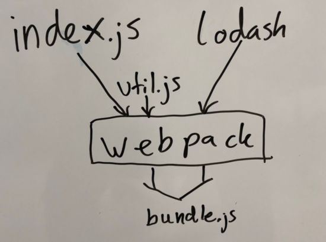

# Learning Webpack Properly

This is course from Jakob Lind, delivered via Email in 5 Lessons over 5 Days

## Lesson 1: What Does Webpack Do?

When you are using webpack, each JavaScript file you write becomes a module. Webpack puts all your modules plus the dependencies (like React) in one big file. This big file is called the "bundle". This makes your code much easier to maintain and it also gives you a quicker load speed with just one round trip.

