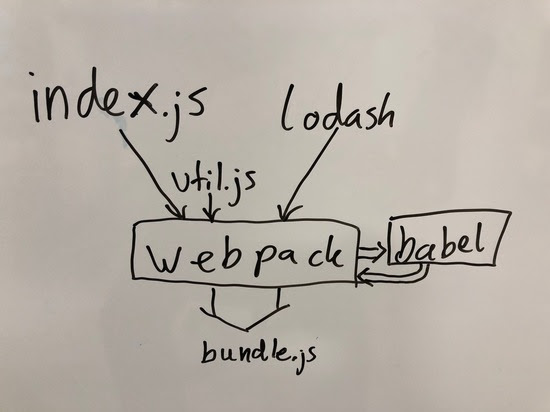
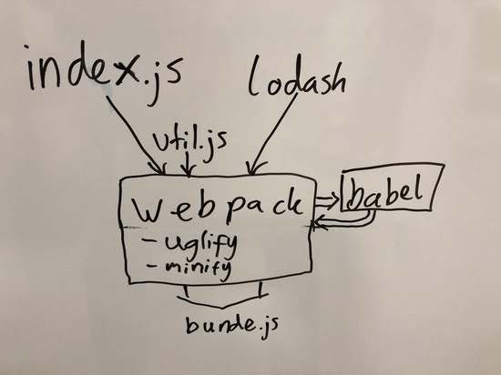

# Learning Webpack Properly

This is course from Jakob Lind, delivered via Email in 5 Lessons over 5 Days

## Lesson 1: What Does Webpack Do

When you are using webpack, each JavaScript file you write becomes a module. Webpack puts all your modules plus the dependencies (like React) in one big file. This big file is called the "bundle". This makes your code much easier to maintain and it also gives you a quicker load speed with just one round trip.






## Lesson 2: Your First Webpack Project

First, we create a new directory for our project and install NPM if needed

```bash
mkdir my-first-webpack
cd my-first-webpack
npm init -y
```

Then, we make a `src` directory and put some JavaScript in it

```bash
mkdir src
```

Create an `index.js` file, with the following contents:

```javascript
console.log("hello world!");
```

Install Webpack

```bash
npm install --save-dev webpack
npm install --save-dev webpack-cli
```

Update your `package.json` file's scripts sections with this to add a Webpack Command

```json
"scripts": {
    "build": "webpack --mode development"
  }
```

Finally, run Webpack

```bash
npm run build
```

**NOTES:**

- This creates a development build, to make a production build, use, `--mode production`
- We didn't need to create a `webpack.config.js` file for this because it's so simple

## Lesson 3: Your First webpack.config.js File & Babel

### 3.1 Your First webpack.config.js

In this lesson, we add Babel to our Webpack config

First, create your `webpack.config.js` file and add these lines

```javascript
const webpack = require('webpack');
const path = require('path');
const config = {
  entry: './src/index.js',
  output: {
    path: path.resolve(__dirname, 'dist'),
    filename: 'bundle.js'
  }
}
module.exports = config;
```

This file now defines an entry and output file

Run webpack as before `npm run build` and you will see `bundle.js` in the `dist` folder now

### 3.2 Loaders To Transform Anything You Want

- Loaders help webpack understand file types aside from JavaScript
- They convert a file into a valid *module* that Webpack can process

Here's how it will look in your Webpack Config

```javascript
const webpack = require('webpack');
const path = require('path');
const config = {
  entry: './src/index.js',
  output: {
    path: path.resolve(__dirname, 'dist'),
    filename: 'bundle.js'
  },
  module: {
    rules: [
      // all your loaders will be here.
      // loaders enables you to use all kinds of
      // file types
    ]
  }
}
module.exports = config;
```

### 3.3 Use Babel Loader To Transform ES6

First, install Babel

```bash
npm install --save-dev babel-loader @babel/core @babel/preset-env
```

Create a `.babelrc` file to configure it

```json
{
  presets: ['@babel/preset-env']
}
```

This will enable us to transpile the latest version of JavaScript

Next, we add babel to our webpack config file under the modules section

```json
module: {
    rules: [
       // here
    ]
  },
```

- A Rule has at least two keys, `test` and `use`
- *Test* is a regex that describes what files Webpack should use this loader on
- *Use* is the name of the Loader

This is what it will look like for Babel

```json
module: {
    rules: [
      {
        test: /\.(js)$/,
        exclude: /node_modules/,
        use: 'babel-loader'
      }
    ]
  },
```

- We will run the loader on all `.js` files
- However, we exclude Node Modules
- We're using the `babel-loader` Loader

Now that it's all set up, build it: `npm run build`

Let's add this ES6 Code to see if it transpiles

```javascript
const hello = () => {
    console.log("hello world!");
}
hello();
```

Run Webpack again: `npm run build`

The transpiled JS should look something like this:

```javascript
eval("var hello = function hello() {\n  console.log(\"hello world!\");\n};\n\nhello();\n\n//# sourceURL=webpack:///./src/index.js?");
```

## Lesson 4: How To Create a React App With Webpack

This lesson will teach how to create a React App with Webpack

### 4.1 Create React Code

First, add React

```bash
npm install --save react react-dom
```

Then, replace the contents of `index.js` with some JSX and add an `index.html` file

`index.js`

```JSX
import React from "react";
import ReactDOM from "react-dom";
class App extends React.Component {
  render() {
    return Hello {this.props.name};
  }
}
var mountNode = document.getElementById("app");
ReactDOM.render(, mountNode);
```

```html
<!DOCTYPE html>
<html>
    <head>
        <title>React starter app</title>
    </head>
    <body>
        <div id="app"></div>
        <script src="bundle.js"></script>
    </body>
</html>
```

### 4.2 Configure Babel To Transpile JSX

Add Babel's React Preset

```bash
npm install --save-dev @babel/preset-react
```

Configure your `.babelrc` file to use the plugin

```json
{
  "presets": ["@babel/preset-env", "@babel/preset-react"]
}
```

### 4.3 Make Webpack Understand JSX

In your Webpack Config File, Add JSX to the test portion of Babel

```json
  // test: /\.(js)$/,
  test: /\.(js|jsx)$/,
```

#### 4.3.1 Resolver Extensions

- Webpack can infer what extensions a file that is being imported may have
- Ex.) `import FileBrowser from 'components/FileBrowser';` — Here, Webpack knows this is a `.js` file
- Webpack doesn't do this with `.jsx` by default

To add `.jsx` as a resolver, do this in your webpack config:

```json
  resolve: {
    extensions: ['.js', '.jsx'],
  },
```

**NOTE:** You have to add `.js` here because adding this Resolver will override Webpack's Default
